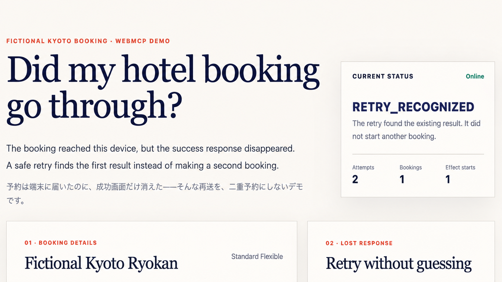

# Kyoto Booking Retry Proof

**A WebMCP demo that stops one fictional Kyoto hotel booking from becoming two when the success response disappears.**

**通信が切れても、京都の架空ホテル予約を二重にしない実演です。**

> **What it saves:** no second charge risk, no foreign-language cancellation hunt, and no guessing whether the first booking worked.
>
> **Visible result:** `2 attempts → 1 simulated booking → 1 confirmation number`

**WebMCP, plainly:** the website exposes small named actions with checked inputs and structured results, so an assistant can ask what happened instead of reading pixels or blindly resending. **The agent checks; only the traveler confirms.** There is no agent-facing confirmation, payment, or cancellation action.

**60-second test:** **1. Check and prepare** → **2. Confirm booking — human action only** → **Retry the same booking** → verify `RETRY_RECOGNIZED`, attempts `2`, bookings `1`, effect starts `1`, and the same confirmation number.

**Open:** [Public ChatGPT Site](https://kyoto-booking-retry-proof.anionix.chatgpt.site) · [2-minute-30-second video](https://youtu.be/tdSvJw4ghX8) · [Devpost](https://devpost.com/software/project-y79pb23hj1mz) · [Vercel backup](https://kyoto-booking-retry-proof.vercel.app)

[](https://kyoto-booking-retry-proof.anionix.chatgpt.site)

## Verifiable Offline WebMCP Agent Architecture / 検証可能なオフライン WebMCP エージェント設計

**Version:** `0.1.0` · **Generated:** `2026-08-27T09:34:00Z` · **Root UUID namespace:** `47f3e535-0e27-559a-9556-aa79a84f95eb`

> **本質だけ言う / The essence:** **The LLM proposes; policy permits; WebMCP acts; evidence verifies; events remember; cryptography binds.**
>
> **LLMは案を出すだけ。許可は数理policy、実行はWebMCP、成功判定は証拠。ログは後から盛れない形でbindする。**

This repository is a bilingual, GitHub-ready design specification for a mobile-first, offline-capable, verifiable agent architecture. It is **Open Knowledge–style**, using JSON-LD, PROV-O, DCAT-like catalog metadata, JSON Schema, UUIDv5/v7, machine-readable claims/formulas/requirements, formal models, and executable reference code. It does **not** claim conformance to a single official standard named “Open Knowledge Format.”

このリポジトリは、モバイル優先・オフライン対応・検証可能なエージェント設計を、英日併記、JSON-LD、PROV-O、DCAT風catalog、JSON Schema、UUIDv5/v7、形式仕様、実行可能な参照コードでまとめたものです。「Open Knowledge Format」という単一の公式標準への適合を主張するものではありません。

> **公開状態 / Public status:** これは設計仕様と参照実装であり、実働製品ではありません。訪日旅行者向けホテルデモは、[ChatGPT Sites](https://kyoto-booking-retry-proof.anionix.chatgpt.site)と[Vercel](https://kyoto-booking-retry-proof.vercel.app)で一般公開し、四つのWebMCP機能、二回の試行から一件への収束、同じ確認番号、再読込まで確認済みです。審査向け[YouTube動画](https://youtu.be/tdSvJw4ghX8)も一般公開済みです。[Devpostの一般プロジェクトページ](https://devpost.com/software/project-y79pb23hj1mz)は、画面の題名と見出しを`Kyoto Booking Retry Proof`にし、ホテル向け説明、60秒の試し方、公開URL、動画、153件のNode試験を版11まで反映しました。ホテル画面画像の配信URLは匿名HTTP 200ですが、公開HTMLの`og:title`は旧名`未定`、`og:image`はDevpost既定画像のままなので、画像とプロジェクトの関連付けは`INCONCLUSIVE`です。提出回答も揃っていますが、WebMCP Challengeの最終送信はまだ行っていません。実ホテル予約、決済、取消は一切行いません。`0.2.0`通知デモの既存証拠は変更せず保存しています。

## Architectural stance / 設計の立場

| Layer | 日本語 | English |
|---|---|---|
| WebMCP | 構造化された主要行動基盤 | Primary structured action substrate |
| Responses API | オンライン時だけ使えるoptional planner | Optional online planner |
| Tool Contract Engine | ALLOW / DENY / HUMAN / RECONCILEの決定権者 | Decision authority |
| Evidence Engine | toolの自己申告ではなく現実を検証 | Verifies reality, not only tool claims |
| EFSM / TLA+ | 危険状態を到達不能にする | Makes dangerous states unreachable |
| Signed Event Log | provenance、replay、tamper evidence | Provenance, replay, and tamper evidence |
| SLO Optimizer | 安全制約内でthreshold/budgetを最適化 | Optimizes thresholds and budgets under safety constraints |

> **ここ、事故るポイント / This is where things break:** `timeout != failure`. UNKNOWNな副作用をそのままretryすると、二重送金・二重送信になる。だから `AMBIGUOUS → RECONCILE → KNOWN` を強制する。

## Start here / 読む順番

1. [`DESIGN_SPEC.md`](DESIGN_SPEC.md) — integrated bilingual specification / 英日統合仕様
2. [`docs/00-executive-summary.ja.md`](docs/00-executive-summary.ja.md) / [`en`](docs/00-executive-summary.en.md)
3. [`docs/specification.ja.md`](docs/specification.ja.md) / [`en`](docs/specification.en.md)
4. [`docs/source-map.md`](docs/source-map.md), [`docs/test-catalog.md`](docs/test-catalog.md), and [`docs/validation-report.md`](docs/validation-report.md)
5. [`knowledge/project.json`](knowledge/project.json) and [`knowledge/graph.jsonld`](knowledge/graph.jsonld)
6. [`formal/tla/ToolExecution.tla`](formal/tla/ToolExecution.tla)
7. [`src/typescript/evaluator.ts`](src/typescript/evaluator.ts)
8. [`docs/13-notification-demo.ja.md`](docs/13-notification-demo.ja.md) / [`en`](docs/13-notification-demo.en.md) — duplicate-safe local notification reference
9. [`docs/14-notification-visualization.ja.md`](docs/14-notification-visualization.ja.md) — two requests to one measured effect, visualized / 二要求を一効果へ収束する画面契約
10. [`docs/15-webmcp-input-boundary.ja.md`](docs/15-webmcp-input-boundary.ja.md) — strict WebMCP input projection / WebMCP入力の厳格投影
11. [`docs/16-webmcp-provenance-adapter.ja.md`](docs/16-webmcp-provenance-adapter.ja.md) — isolated draft adapter and durable provenance / 専用アダプターと来歴読み戻し
12. [`docs/17-offline-sync-reference.ja.md`](docs/17-offline-sync-reference.ja.md) — signed two-device reconciliation with dangerous-effect quarantine / 署名付き二端末同期と危険な外部効果の隔離
13. [`docs/18-online-planner-reference.ja.md`](docs/18-online-planner-reference.ja.md) — optional candidate planner with tool, privacy, cost, latency, and authority boundaries / 道具・情報・費用・遅延・権限を制限した任意計画器
14. [`docs/19-slo-gate-reference.ja.md`](docs/19-slo-gate-reference.ja.md) — six hard operational-quality gates with deterministic counterexamples / 6つの運用品質判定と固定した反例
15. [`formal/wolfram/ReferenceModel.wl`](formal/wolfram/ReferenceModel.wl)
16. [`docs/20-final-verification.ja.md`](docs/20-final-verification.ja.md) — bounded browser observation, two formal checks, and the 67-test public-evidence boundary / ブラウザー実測・二つの形式検証・67件の公開証拠境界
17. [`docs/21-review-thread-reconciliation.ja.md`](docs/21-review-thread-reconciliation.ja.md) — 32 review findings bound to fixes and regression evidence / 32件のレビューを修正と回帰証拠へ結合
18. [`docs/22-service-integrations.ja.md`](docs/22-service-integrations.ja.md) — eight service boundaries and the everyday value of preventing duplicate sends / 8サービスの境界と二重送信防止の生活価値
19. [`docs/23-hotel-booking-demo.ja.md`](docs/23-hotel-booking-demo.ja.md) — fictional Kyoto hotel retry demo, four-tool boundary, and local verification / 架空の京都宿再送デモ、四機能境界、ローカル検証

## Machine-readable assets / 機械可読asset

- `knowledge/*.json` — sources, claims, formulas, requirements, tests, decisions, components, risk classes, timeline, provenance
- `knowledge/*.jsonld` — linked graph and context
- `schemas/*.schema.json` — structural contracts
- `data/golden-vectors.json` — conformance vectors
- `data/timeseries/*.ndjson` — source/design/runtime time series
- `data/audit/*.json|ndjson` — signed sample log, Merkle checkpoint, inclusion proof, tamper report
- `metadata/file-catalog.json` — UUIDv5/v7 and temporal metadata for every project file
- `metadata/final-verification.json` — bounded WebMCP observation, formal results, 67-test count, and zero-effect final evidence
- `metadata/service-integration-registry.json` — eight official resource services, truthful readiness states, and illustrative duplicate-risk scenarios
- `metadata/hotel-booking-verification.json` — local browser, offline, responsive, and design-fidelity evidence for the fictional hotel demo
- `metadata/demo-video-production.json` — generated-media prompts, service identifiers, billing boundary, local paths, and SHA-256 values without committing the video files
- `metadata/security-remediation.json` — one-to-one CodeQL alert and issue ledger, separate dependency audits, and the pending main-branch rescan gate
- `MANIFEST.sha256` — artifact integrity manifest

The four 1.0.0 governance slices bind security, replay, operational-quality, browser-observation, and formal-evidence claims. The catalog contains **67 implemented and automated tests, with no partial or specification-only records**. Critical commit tools remain inside policy control; replay requires six fresh checks; an external effect needs independent readback rather than a tool claim alone; and six hard mathematical gates stop unsafe capacity, calibration, probability, or provenance inputs. Production operational quality remains `UNMEASURED`, and native WebMCP conformance remains `INCONCLUSIVE`. See [`src/typescript/governance/security-boundary.ts`](src/typescript/governance/security-boundary.ts), [`src/typescript/governance/replay-verification.ts`](src/typescript/governance/replay-verification.ts), [`src/typescript/governance/slo-gates.ts`](src/typescript/governance/slo-gates.ts), [`metadata/final-verification.json`](metadata/final-verification.json), and [`docs/test-catalog.md`](docs/test-catalog.md).

## Validation / 検証

```bash
make validate
```

The validation pipeline parses all JSON/NDJSON/YAML, checks schemas and cross-references, verifies UUID versions and UUIDv7 timestamps, runs TypeScript golden vectors, verifies Ed25519 signatures/hash chains/Merkle roots, runs the independent reachability model, and rebuilds the final evidence in memory for a byte-for-byte comparison.

Review comments are bound one-to-one to their tracking Issues in [`metadata/review-comment-issue-ledger.json`](metadata/review-comment-issue-ledger.json), with the mapping checked by [`scripts/validate_review_comment_issues.mjs`](scripts/validate_review_comment_issues.mjs). レビューコメントと追跡課題の一対一対応は、同じ台帳と検査で機械的に確認します。

`make validate` only checks tracked artifacts; it does not regenerate them. After an intentional source change, run `make regenerate`, review the diff, and then run `make validate` twice. Dependency versions are fixed by `uv.lock`, the root `package-lock.json`, `src/typescript/package-lock.json`, `.python-version`, and `.node-version`.

The bounded source-quality gate uses Oxlint for the hotel JavaScript, Biome for the hotel page markup and styles, and Oxfmt for the newly governed formatting surface. It avoids rewriting historical files while making the current demo mechanically reviewable.

```bash
npm run quality:check
npm run lsp:oxlint
npm run lsp:oxfmt
npm run lsp:biome
```

Each `lsp:*` command starts one code-analysis server for editor integration and keeps running until the editor stops it. The fixed versions and integrity values are recorded in `package-lock.json`.

## Python type analysis / Python型解析

<!-- information_uuid_v5=0295e1e4-5327-5304-8f27-a63d49de4ba3 -->
<!-- event_uuid_v7=01a04c99-d1c3-776e-9e68-78f0ce19ce97 state_transition=PYTHON_TYPE_ANALYSIS_UNCONFIGURED -> VERSION_PINNED -> PROJECT_SCOPE_CONFIGURED -> TYPE_CHECKS_PASSED -> LANGUAGE_SERVER_HANDSHAKES_VERIFIED occurred_at=2026-08-29T08:19:04.259Z -->
<!-- machine-contract=Both exact development dependency versions, both configured project checks, and both initialize and shutdown language-server handshakes must pass without a global installation or generated configuration migration. -->

`ty 0.0.75` and Pyrefly `1.2.0` are exact project development dependencies in `pyproject.toml` and `uv.lock`. The two tools check the same seven Python files under `scripts` and `formal/model-checker`, targeting the repository minimum Python version, 3.12. `ty` remains beta software; Pyrefly is recorded separately as stable. No global installation was performed, and `pyrefly init` was not run.

`ty 0.0.75`とPyrefly `1.2.0`を、`pyproject.toml`と`uv.lock`の開発依存へ完全一致で固定しました。両方とも、`scripts`と`formal/model-checker`にある同じ7個のPythonファイルを、リポジトリの最小Python版3.12として検査します。`ty`はベータ版、Pyreflyは安定版として状態を分けています。端末全体への導入と`pyrefly init`は行っていません。

```bash
make typecheck-python
make validate-python-tools
make lsp-ty
make lsp-pyrefly
```

`make validate-python-tools` verifies the exact versions, macOS Arm64 wheel SHA-256 values, configured file inventory, both type checks, and full initialize/shutdown handshakes with both language servers. The `lsp-*` commands are the long-running editor entry points. Primary references are the official [ty installation](https://docs.astral.sh/ty/installation/), [ty type-checking](https://docs.astral.sh/ty/type-checking/), [Pyrefly installation](https://pyrefly.org/en/docs/installation/), and [Pyrefly editor integration](https://pyrefly.org/en/docs/IDE/) pages. Machine-readable evidence is in [`metadata/python-type-tools.json`](metadata/python-type-tools.json).

## Void local integration / Void端末内連携

<!-- information_uuid_v5=294f20c3-0104-56ef-96c4-3a262bd9d7a4 -->
<!-- event_uuid_v7=01a04c82-7268-7a01-b288-6d617c70cf55 state_transition=VOID_NOT_CONFIGURED -> VOID_LOCAL_AND_GLOBAL_MCP_CONFIGURED -> VOID_STATIC_VALIDATE_READY -> VOID_AUTH_AND_DEPLOY_NOT_RUN occurred_at=2026-08-29T07:53:32.520Z -->
<!-- machine-contract=Void installation and local validation readiness do not imply authentication, project linking, deployment, or public readback; those later states remain incomplete. -->
<!-- event_uuid_v7=01a04cb2-3f0b-7892-bd37-f806bd1512f5 state_transition=DEPENDENCY_ALERTS_TRACKED -> DEPENDENCY_GRAPH_PATCHED -> GITHUB_MAIN_READBACK_PENDING occurred_at=2026-08-29T08:45:45.099Z -->
<!-- machine-contract=Each open Dependabot alert maps to one issue before remediation; local zero findings do not become fixed-on-main until GitHub reads the merged dependency graph. -->
<!-- information_uuid_v5=59aace12-7f9d-59bb-9b87-55c42e4f5c53 -->
<!-- event_uuid_v7=01a04cfc-c4d4-7d80-af61-0a7e1146082b state_transition=DIST_ASSUMED_PRESENT -> STANDALONE_VALIDATION_BUILDS_FIRST occurred_at=2026-08-29T10:07:09.012Z -->
<!-- machine-contract=npm run validate:void builds the deterministic web artifact before validating it, while the clean-checkout regression copies tracked source but never copies ignored dist. -->
<!-- information_uuid_v5=5b035010-7491-5f10-a312-2fcf372317f3 -->
<!-- event_uuid_v7=01a04cfc-c4d5-73b4-8ef0-f22de3c54e65 state_transition=GLOBAL_REGISTRATION_ASSERTED -> HOST_OBSERVATION_UNVERIFIED occurred_at=2026-08-29T10:07:09.013Z -->
<!-- machine-contract=The repository proves a pinned project package and local invocation, not Codex-wide host registration; the historical host observation never becomes a fresh-checkout claim. -->

Void `0.10.12` is fixed as an exact project development dependency. `npm run validate:void` first builds the deterministic web artifact and then validates the separate static adapter in `void.json`; `npm run test:void:clean` proves that flow from tracked source without copying the ignored `dist` directory. Database, key-value, storage, and artificial-intelligence bindings remain disabled, and `voidPlugin` is not added to the existing `cloudflare()` and `sites()` Vite plug-ins. Void shares the reviewed root dependency set: Cloudflare Vite plug-in `1.54.2`, Wrangler `4.127.1`, Vite `8.2.2`, Undici `7.29.0`, Sharp `0.35.2`, and ws `8.21.0`. All 17 open Dependabot alerts were mapped individually to issues #73–#89 before the patch; local `npm audit` then reported zero known vulnerabilities.

Void `0.10.12`をプロジェクトの開発依存として完全一致で固定しました。`npm run validate:void`は決定論的なWeb成果物を先に構築してから`void.json`の静的アダプターを検査し、`npm run test:void:clean`は無視対象の`dist`をコピーしない新規取得相当の条件で同じ流れを確認します。データベース、キーと値、保管、人工知能の各結合はすべて無効で、既存の`cloudflare()`と`sites()`へ`voidPlugin`を重ねません。Voidは、検査済みのルート依存集合（Cloudflare Vite plug-in `1.54.2`、Wrangler `4.127.1`、Vite `8.2.2`、Undici `7.29.0`、Sharp `0.35.2`、ws `8.21.0`）を共有します。公開中だったDependabot警告17件は修正前に課題#73〜#89へ一件ずつ対応付け、端末内の`npm audit`は既知の脆弱性0件になりました。

The tracked `npm run mcp:void` command starts the pinned project documentation server; it does not register Void in Codex globally. The ledger value `REGISTERED_ENABLED_RESTART_REQUIRED` is retained only as a historical observation reported by the setup host. A fresh checkout therefore records Codex-wide availability as `HOST_OBSERVATION_UNVERIFIED` until that host configuration is independently read back. Project dependency installation, host registration, provider authentication, project linking, publication, and runtime execution remain separate states.

追跡済みの`npm run mcp:void`は固定したプロジェクト内の文書サーバーを起動するだけで、Codex全体へVoidを登録する操作ではありません。台帳値`REGISTERED_ENABLED_RESTART_REQUIRED`は、設定に使った端末から報告された過去の観測としてだけ保持します。したがって、新しい取得環境でのCodex全体の利用可否は、端末構成を独立して読み戻すまで`HOST_OBSERVATION_UNVERIFIED`です。プロジェクト依存の導入、端末登録、提供元認証、プロジェクト接続、公開、実行は別状態です。

<!-- information_uuid_v5=63aa7af6-ddbb-5422-b2f0-2fda9e60fc39 -->
<!-- event_uuid_v7=01a04cdc-3b33-7720-9567-66e1e046e0ea state_transition=CODE_SCANNING_UNMEASURED -> CODEQL_CONFIGURED -> 13_ALERTS_ISSUEIZED -> LOCAL_PATCH_VALIDATED -> GITHUB_RESCAN_PENDING occurred_at=2026-08-29T09:31:36.627Z -->
<!-- machine-contract=Each CodeQL alert maps to exactly one public tracking issue without exploit instructions; fixed-on-main is claimed only after a successful merged-commit analysis reads back no matching open alert. -->

GitHub CodeQLの既定設定は、Actions、JavaScript・TypeScript、Pythonを対象に拡張検査で有効化しました。初回解析の13件は課題#91〜#103へ一件ずつ結び付けています。動的な正規表現と実行ファイル選択を固定契約へ変更し、通知デモの保存先を固定領域へ制限し、自作UUIDv5処理を推移依存のない標準実装`14.0.2`へ置き換えました。ルートとTypeScript参照パッケージを別々に監査し、どちらも既知の脆弱性0件でした。現時点は端末内修正済み・GitHub再解析待ちであり、CodeQL警告0件とはまだ主張しません。

```bash
npm run validate:void
npm run test:void:clean
npm run build:void:static
```

Voidの認証、プロジェクト接続、配置はまだ行っていません。`npm run deploy:void:static`は将来の明示的な配置操作であり、現時点の公開成功を表しません。公式の[Quickstart](https://void.cloud/guide/quickstart)、[Agents integration](https://void.cloud/integrations/agents)、[CLI reference](https://void.cloud/reference/cli)を一次情報としています。

導入、Codex登録、認証、接続、公開、依存関係監査の状態は[`metadata/void-integration.json`](metadata/void-integration.json)へ分けて記録しています。

<!-- information_uuid_v5=81366b7a-5c59-5af5-be85-e988d824320c -->
<!-- event_uuid_v7=01a04aa0-782f-7b3e-8cec-6cb8a87937df state_transition=SERVICE_BOUNDARIES_DOCUMENTED -> EVERYDAY_DUPLICATE_VALUE_VISIBLE occurred_at=2026-08-28T23:07:05.647Z -->
<!-- machine-contract=Every service example is illustrative and unobserved; current deployment state comes from metadata/service-integration-registry.json. -->

## Everyday value of duplicate prevention / 二重送信を防ぐ生活価値

A lost response must not turn one human intention into two real-world effects. The concrete risks are easy to recognize: an OpenAI or Chrome agent repeats a notification or form; a page hosted on Cloudflare, Vercel, Render, or Netlify repeats an alert, job, or booking after a network or process interruption; a Shopify cart receives two items instead of one; or a Devpost submission helper sends the same version update twice. Preventing the second effect reduces extra cost, correction work, confusion, and trust loss.

応答が消えても、1回の意思を現実の2回の結果にしてはいけません。OpenAIやGoogle Chromeでは通知・フォームの再実行、Cloudflare・Vercel・Render・Netlifyでは通信切替、二度押し、処理再開後の警告・仕事・予約の重複、Shopifyでは1個のつもりが2個になるカート操作、Devpostでは版更新通知の重複が想定例です。いずれも各サービスで観測した事故ではなく、設計を確認するための例です。詳細な状態と承認境界は[`docs/22-service-integrations.ja.md`](docs/22-service-integrations.ja.md)、機械可読の正本は[`metadata/service-integration-registry.json`](metadata/service-integration-registry.json)にあります。

今回の限定したローカル確認では、アプリ内ブラウザーから同じ`notify_once`操作を2回呼び、同じUUIDv5 Intentと外部効果開始数`0`を確認しました。これは共通成果物の確認であり、各外部サービスでの本番実証ではありません。

## Fictional Kyoto hotel retry demo / 架空の京都宿・再送デモ

This English-first, Japanese-supported demo answers one ordinary travel problem: the booking reached the device, but the success response disappeared. Dates, adults, rooms, the fictional hotel, and its fixed plan form one UUIDv5 identity; presentation language is excluded. A visible human button alone can commit the simulated booking. A retry then recovers the same confirmation number and displays `2 attempts → 1 simulated booking → 1 confirmation number`.

英語を主表示、日本語を補助表示にした架空予約デモです。料金は一室一泊12,000円、1〜14泊、大人1〜4人、部屋1〜2室、一室最大2人です。無料取消期限と想定料金は表示だけで、予約状態を変えません。個人情報、決済、実ホテル、メール、外部予約、実際の取消は扱いません。

```bash
npm ci
npm run build:web
npm run validate:hotel
```

The shared build produces `dist/client/**` for Vercel, Netlify, and Render configuration checks, `dist/server/index.js` for the Cloudflare-compatible Sites package, and `dist/.openai/hosting.json` for the owning Site. The page registers exactly these four WebMCP capabilities:

- `check_existing_hotel_booking`
- `prepare_hotel_booking`
- `get_hotel_booking_status`
- `preview_hotel_cancellation`

Confirmation, payment, and cancellation mutation are deliberately absent. IndexedDB unique constraints, UUIDv7 events, and a SHA-256 forward chain protect the local result across repeated clicks, two tabs, reload, and retry. ChatGPT Sites and Vercel do not share browser storage, so the page explicitly says the fictional result belongs only to this device and deployment.

Local evidence currently passes 153 Node tests, TypeScript checking, four-tool discovery and execution in the in-app browser, a WebMCP preparation that enables the separate human confirmation button, arbitrary-input reload restoration, production-build offline reload, and 320/375/390/768-pixel overflow checks. The booking test also counts the physical IndexedDB booking rows and finds exactly one.

Public ChatGPT Sites version 11 uses exact source commit `51fdc38fa4c4cf9d66473bdb22f35ecb93a444cf` in version `appgprj_6a923239002081918896546134a7dc8f~appgver_40087b159eb8819197ae93e67e78a50d` and deployment `appgdep_6a92a1cf0bb08191bbd00064ac2cdd12` at the existing [public URL](https://kyoto-booking-retry-proof.anionix.chatgpt.site). The URL returned anonymous HTTP 200 and its delivered `service-integrations.json` matched the then-deployed registry SHA-256. A fresh version 10 browser run on dependency-patched commit `5ac1fe51a29800eb052f9a63e7311559b7c01e45` directly proved `PREPARED → COMMITTED → RETRY_RECOGNIZED`, two attempts, one booking, one effect start, four WebMCP tools, and confirmation `FKR-7EF2A00FA2`; version 11 has the same functional digest and restored that result after reload. The new registry containing Devpost version 11 is validated as a separate worktree candidate and is not claimed as the current full Sites package. The current [Vercel hotel demo](https://kyoto-booking-retry-proof.vercel.app) was published from a dirty worktree whose provider Git metadata named commit `037496f6db7281b7b1a9ecd9b3dfc71d407feeb6`; it is not claimed as an exact clean-commit deployment. Deployment `dpl_8kb6oNsU2dFwEu997zbj4zpeuWSL` became `READY` at `2026-08-29T12:30:35.535Z`; its [deployment-specific URL](https://kyoto-booking-retry-proof-4p3pru70s-aniotajp-1978s-projects.vercel.app) and alias expose five anonymously fetched files that match the expected artifacts, with provider warning and error readbacks both zero. Its functional source commit `5ac1fe51a29800eb052f9a63e7311559b7c01e45` and digest `06a753e5cd240eebd0663c57031a0993e87cbb87c7d61401eb220dbacd91e132` match the directly exercised deployment `dpl_4uthDyjgSi1KxbssW9t5u18xJbLs`; that earlier retry proof is carried forward and is not described as a new browser run on the current deployment.

One deployment operation mistakenly targeted the legacy notification project. Its production alias was immediately restored to deployment `dpl_3KTHTtZ5h8quDhviMTRo5GxBuUuE`; the anonymous URL returned HTTP 200 and showed the notification demo again.

<!-- information_uuid_v5=8e656bba-df14-5ee2-9348-f6239fb7edf9 event_uuid_v7=01a04cf7-edba-71cd-b1c5-c8271758d1b4 state_transition=SELF_CERTIFIED_ARTIFACT_BINDING -> ARTIFACT_TO_VIDEO_IDENTITY_UNMEASURED occurred_at=2026-08-29T10:01:51.802Z -->
<!-- machine-contract=Public playback, duration, and subtitles are readback facts; without an independent upload-operation receipt, the local file digest and public YouTube identifier are not asserted to identify the same artifact. -->

The locally verified 150-second 1920×1080 review video version 10 contains 20 disclosed seconds of fictional generated dramatization and 113.2 seconds (75.5%) of actual public Site screen recording. Its local SHA-256 is `3c2635029fe01f5a9f20b4effddd62a8d5c1edc28e1e90db443645dbe78c49e7`. Separately, public readback of [WebMCP vs Duplicate Bookings: A Live Demo](https://youtu.be/tdSvJw4ghX8) confirms anonymous playback, a 150-second duration, completed processing, no copyright issue, English audio and captions, and a published Japanese subtitle track. No independent upload-operation receipt is retained, so the local artifact-to-public-video identity is `UNMEASURED`; equal duration and an editable self-record do not prove file identity.

端末内で検査した150秒・1920×1080の動画版10は、架空の生成映像20秒と実際の公開Site画面録画113.2秒（75.5%）を含み、端末内SHA-256は`3c2635029fe01f5a9f20b4effddd62a8d5c1edc28e1e90db443645dbe78c49e7`です。これとは別に、公開YouTubeの読み戻しでは、匿名再生、150秒の再生時間、処理完了、著作権問題なし、英語音声・字幕、日本語字幕トラックを確認しました。独立したアップロード操作の受領記録は保存されていないため、端末内ファイルと公開動画の同一性は`UNMEASURED`であり、時間の一致や編集可能な自己記録だけでは同一成果物と断定しません。

The owner-selected Canva thumbnail is ready locally, but the public YouTube video still uses a YouTube-generated thumbnail. This is separate from Devpost: the visible page title, heading, Open Graph title, and Open Graph image of its [public project page](https://devpost.com/software/project-y79pb23hj1mz) now identify `Kyoto Booking Retry Proof` and the uploaded hotel screenshot. Version 8 aligned the description to 153 Node tests, version 9 unified the technologies, links, and video, version 10 improved the opening formula and retry-result list, and version 11 added the four-step 60-second test. Devpost submission `1158722` has status `Submitted`; the submit response and authenticated project readback agree on `submitted_at: 2026-08-29T09:14:00.129-04:00`. Keyboard traversal, screen-reader behavior, and Chrome-native WebMCP execution remain `INCONCLUSIVE`. See [`metadata/hotel-booking-verification.json`](metadata/hotel-booking-verification.json), [`metadata/vercel-hotel-deployment.json`](metadata/vercel-hotel-deployment.json), [`metadata/demo-video-production.json`](metadata/demo-video-production.json), and [`docs/23-hotel-booking-demo.ja.md`](docs/23-hotel-booking-demo.ja.md).

## Duplicate-safe notification demo / 二重送信防止通知デモ

The `0.2.0` reference demo stores notification intent, attempts, and effect state in SQLite. A UUIDv5 intent ID is derived from the logical operation, every state change or suppressed retry gets a UUIDv7 event ID, and a hash-chained JSON Lines audit record is appended before an external adapter call. `AMBIGUOUS` never retries directly; only reconciliation is allowed. A retry after `CONFIRMED_ABSENT` now requires fresh authorization, host permission, implementation version, bound consent, lifetime, and precondition evidence. The recorded execution claim remains separate from both the truth estimate and the conservative effect-start count. `STARTED` and `UNKNOWN` each count as one; only an explicit pre-effect `NOT_STARTED` assessment plus independent absence counts as zero. A later current-absence readback cannot erase a possibly earlier display.

```bash
uv sync --frozen
cd src/typescript && npm ci && cd ../..
make validate
make benchmark-notification
make demo
```

Open `http://127.0.0.1:4173`. The page first shows a dry run. A real Mac browser notification is requested only after an explicit click, and the same logical operation is then retried to prove that a second effect is blocked. If `document.modelContext` is absent, native WebMCP support remains `INCONCLUSIVE`; the same typed local path stays usable.

The candidate screen makes that safety path visible: the first request and retry converge on the same intent ledger, while the count card reads the conservative SQLite effect-start ledger and exposes any value above one as a safety violation. A compact six-check rail also shows why a replay is allowed, stopped, unnecessary, or waiting for reconciliation. Desktop and 390-pixel-wide browser checks are documented in [`docs/14-notification-visualization.ja.md`](docs/14-notification-visualization.ja.md), with machine-readable dry-run evidence in [`metadata/replay-independent-verification.json`](metadata/replay-independent-verification.json). In the final bounded observation, the Codex in-app browser discovered `notify_once` through its tab capability, while `document.modelContext` was absent in both the in-app page scope and the connected Chrome page scope. These observations are intentionally separate; broader native WebMCP conformance remains `INCONCLUSIVE`.

The draft WebMCP surface is isolated in one notification adapter. External input provenance is derived from the server route, persisted with the first intent-created event, and independently read back before the browser shows a match. A same-operation request from another channel keeps the first provenance and creates no external effect. See [`metadata/webmcp-provenance-verification.json`](metadata/webmcp-provenance-verification.json); this bounded browser observation does not claim general WebMCP conformance.

The 2026-08-28 live run finished `VERIFIED / CONFIRMED_PRESENT`: Service Worker readback found one notification, the same-operation retry returned `ALREADY_VERIFIED`, the SQLite effect-start count remained one, and the six-event public audit chain validates. See [`metadata/notification-demo-live-verification.json`](metadata/notification-demo-live-verification.json) and [`data/audit/notification-demo-live-events.ndjson`](data/audit/notification-demo-live-events.ndjson). That immutable evidence belongs to the `0.2.0` implementation. The newer independent-verification path adds an explicit reconciliation transition and is currently covered by simulation; this change did not emit another real notification.

## Offline sync evidence demo / オフライン同期証拠デモ

The `0.4.0` reference implementation creates two independent Ed25519-signed device chains, verifies signed Merkle checkpoints, preserves each device sequence while assigning a global ingestion sequence, and detects tampering, gaps, and forks. Only an add-only tag set is merged. Two notification intents become one `HUMAN_REVIEW_REQUIRED` case with **zero notification starts**; the synchronizer exposes no notification execution route.

```bash
make validate
make demo-sync
```

Open `http://127.0.0.1:4174`. The screen is read-only and replays the public evidence as two offline lanes converging through a signature gate. The bounded local simulation is verified; remote transport is unimplemented, production multi-device quality is `UNMEASURED`, and native WebMCP integration remains `INCONCLUSIVE`. See [`metadata/offline-sync-verification.json`](metadata/offline-sync-verification.json) and [`docs/17-offline-sync-reference.ja.md`](docs/17-offline-sync-reference.ja.md).

## Optional online planner evidence demo / 任意オンライン計画器の証拠デモ

The `0.5.0` reference boundary keeps the local path available, exposes only feasible proposal-only tools, removes personal and secret fields, rejects secret-looking public values, and requires a trusted operator-supplied rate card before transport. A completed response becomes only an `UNTRUSTED_PROPOSAL`; it cannot create approval or start an external effect. Timeout and response loss stop without an automatic retry.

```bash
make evidence-planner
make validate
make demo-planner
```

Open `http://127.0.0.1:4175`. The read-only screen shows one simulated candidate ending at a hard boundary before approval and external effect. Thirteen deterministic scenarios produced actual network requests `0`, actual spend `0`, authorization `0`, external effects `0`, and automatic retries `0`. Live Responses API conformance remains `INCONCLUSIVE`; current production pricing and quality are `UNMEASURED`. See [`metadata/online-planner-verification.json`](metadata/online-planner-verification.json) and [`docs/18-online-planner-reference.ja.md`](docs/18-online-planner-reference.ja.md).

## Operational-quality gate evidence / 運用品質判定の証拠

Six hard gates check service capacity, Little's queueing relation, validation-data calibration, probability-mass conservation, bad-commit and duplicate-effect limits, and synthetic-versus-measured provenance separation. Any failed gate returns `STOP`; evidence observed after the evaluation instant also stops. A high objective score cannot override either probability limit, and model self-reported confidence is never used.

```bash
make evidence-slo
make validate
```

The public evidence is a deterministic synthetic fixture with six passing gates and fixed failing counterexamples. It generated no runtime measurement, external effect, or external spend. Production availability, latency, calibration, bad-commit probability, and duplicate-effect probability remain `UNMEASURED`. See [`metadata/slo-gate-verification.json`](metadata/slo-gate-verification.json) and [`docs/19-slo-gate-reference.ja.md`](docs/19-slo-gate-reference.ja.md).

## Final public evidence / 最終公開証拠

The final evidence keeps three boundaries visible instead of flattening them into one claim: the in-app browser's bounded tool discovery is `CONFIRMED_PRESENT`; the standard `document.modelContext` surface was `CONFIRMED_ABSENT` in the observed Chrome page scope; general native WebMCP conformance and version remain `INCONCLUSIVE`. The observed page called no WebMCP tool, made no external page request, requested no notification permission, emitted no notification, and left intent, attempt, effect, and audit counts at zero.

The independent Python explorer reached 38 states with no prohibited state, and an official TLA+ Tools v1.7.4 / TLC 2.19 run found the same 38 distinct states with no invariant error. No Wolfram runtime was available for the current run, so current Wolfram execution is `NOT_EXECUTED`; the captured report is checked separately with exact rational arithmetic. All 67 catalog records are implemented and automated. See [`metadata/final-verification.json`](metadata/final-verification.json) and [`docs/20-final-verification.ja.md`](docs/20-final-verification.ja.md).

```bash
make evidence-final
make verify-tla TLA2TOOLS_JAR=/absolute/path/to/tla2tools.jar
```

The tracked evidence stops at `READY_FOR_PUBLIC_READBACK`. Post-merge `main` readback, unresolved critical-defect count, and the final secret scan belong in the external Issue #45 verification record because a commit cannot honestly attest to its own future public state.

## Primary-source posture / 一次情報源の扱い

The source registry pins official specifications and original papers. WebMCP is explicitly treated as a draft and isolated behind an adapter. Current source metadata is in [`knowledge/sources.json`](knowledge/sources.json), with a human-readable map in [`docs/source-map.md`](docs/source-map.md).

## License

Apache-2.0 for repository content unless otherwise noted. Referenced external specifications and papers remain under their own terms; this repository includes links, metadata, and paraphrases only.
