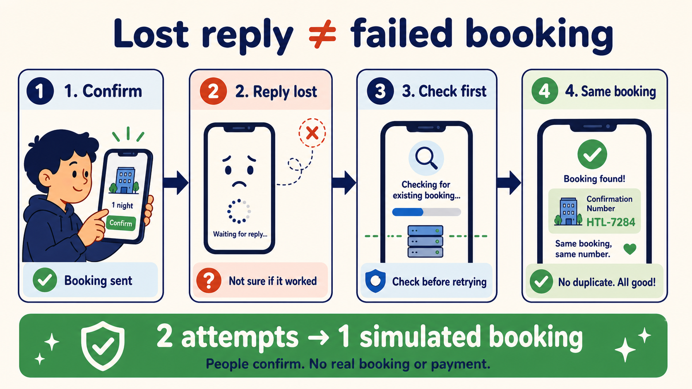
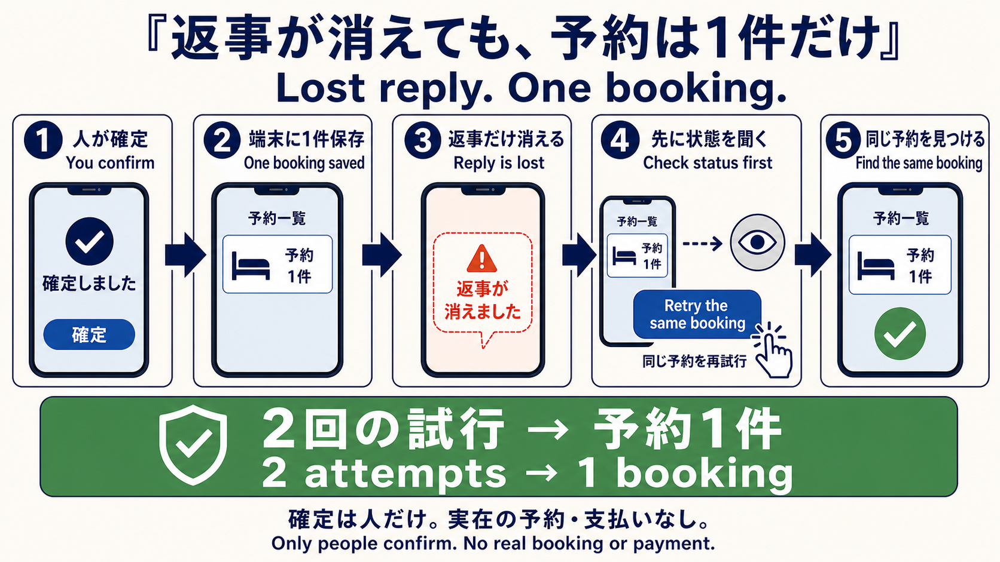

# Kyoto Booking Retry Proof

**A fictional Kyoto hotel booking stays one booking when the success response disappears.**

Visible proof: `2 attempts → 1 simulated booking → 1 confirmation number`.

Current public alignment: the submitted ChatGPT Site is version 14 from source `2fbbf1b714ca660ef1681239b638205a9835f7c5`; the Vercel backup is deployment `dpl_A39LNXnMRAA6RscBYJLkZBok1Y3B` from source `bbb1b611dbaf9bb2172e59da3e63bbe71799bfeb`. Anonymous retrieval of both [`Sites webmcp-evals.json`](https://kyoto-booking-retry-proof.anionix.chatgpt.site/webmcp-evals.json) and [`Vercel webmcp-evals.json`](https://kyoto-booking-retry-proof.vercel.app/webmcp-evals.json) reports the same 194-test release evidence and exact four-tool contract. The [alignment record](../../metadata/public-release-alignment-readback.json) keeps public readback separate from the fresh native execution record.

## Short Japanese summary / 日本語要約

通信が切れて成功表示だけ消えたとき、同じ京都旅館の予約を再送しても一件に戻る架空デモです。WebMCPは確認・準備・状態取得・取消条件の表示だけを行い、確定は画面上の人間だけが押せます。個人情報、決済、実ホテル、メール、外部予約、実際の取消はありません。

## 中学生向けの5段階図 / Five-step beginner guide

<!-- information_uuid_v5=9814fe28-d4ee-5cdc-b331-e6f56c05e54d -->
<!-- event_uuid_v7=01a056be-90df-77a6-afde-13eaa26eae09 state_transition=IMAGE_EDITED_FOR_RETRY_ACTION -> IMAGE_INSPECTED -> README_PLACED occurred_at=2026-08-31T07:35:24.639Z -->
<!-- machine-contract=This generated image is an explanatory, fictional, non-measured guide; it shows status-first reconciliation, an explicit retry action, and one simulated booking, with no real booking or payment. provenance_record=metadata/hotel-retry-student-guide.json; image_gen_invocations=2; sha256=0386b31bab6786ca47730fed8d2adba80263758e158d11dcec339a034ceacd32; -->


返事が消えても、先に状態を調べ、同じ予約を再試行して同じ架空予約を見つけます。 / A lost reply is reconciled before the same booking is retried; the result remains one simulated booking.

<!-- information_uuid_v5=17898066-d1e0-50f3-96c7-e30c23316f5a -->
<!-- event_uuid_v7=01a0539e-63c4-7a72-a39b-276bbe0b7d37 state_transition=IMAGE_GENERATED_ONCE -> SOURCE_SHA256_CAPTURED -> README_ASSET_COPIED occurred_at=2026-08-30T17:01:24.292Z -->
<!-- machine-contract=This explanatory diagram is not measured-screen or real-booking evidence; image_gen_invocations=1; source_sha256=e02b5778dc1f111936919a4cf4b6484330391e05fc69eed9435b8049bc28519c; provenance_record=metadata/hotel-retry-diagram.json; historical_events=UNCHANGED. -->
<!-- event_uuid_v7=01a0550d-8b4b-77be-a8a3-4d8c5b478e87 state_transition=IMAGE_EDITED_FOR_RETRY_ACTION -> SOURCE_SHA256_CAPTURED -> README_ASSET_COPIED occurred_at=2026-08-30T23:42:26.123Z -->
<!-- machine-contract=This explanatory diagram remains fictional and non-measured; image_gen_invocations=2 (initial generation plus targeted edit); source_sha256=a8960459316bd8fa1853b3dc42d7ba4583198eff98ced31a375c420dbaebb141; previous_source_sha256=e02b5778dc1f111936919a4cf4b6484330391e05fc69eed9435b8049bc28519c; provenance_record=metadata/hotel-retry-diagram.json; historical_events=RETAINED. -->


This explanatory diagram shows the fictional retry path: check the device state first, press Retry the same booking, then return the same booking. / この説明図は、再送前に端末の状態を確認し、「同じ予約を再試行」を押してから同じ予約を返す架空デモの流れを示します。
It is not a measured screen or evidence of an additional real booking. / 実測画面や追加の実予約の証拠ではありません。
Only a person makes the final confirmation; there is no real booking or payment. / 最終確定は人だけが行い、実在の予約・支払いはありません。

## Open first

- [Primary ChatGPT Site](https://kyoto-booking-retry-proof.anionix.chatgpt.site)
- [60-second result video](https://youtu.be/tdSvJw4ghX8)
- [Devpost project](https://devpost.com/software/project-y79pb23hj1mz)
- [Vercel backup](https://kyoto-booking-retry-proof.vercel.app)
- [English visual guide](https://github.com/Anionix/verifiable-offline-webmcp-agent-spec/blob/main/docs/25-devpost-visual-guide.en.md)
- [日本語の視覚導線](https://github.com/Anionix/verifiable-offline-webmcp-agent-spec/blob/main/docs/25-devpost-visual-guide.ja.md)

## 60-second judge path

1. Open the public Vercel page in a supported HTTPS Chrome WebMCP configuration and discover the four named tools.
2. Use `check_existing_hotel_booking`, then `prepare_hotel_booking` for the fictional `Fictional Kyoto Ryokan` and `Standard Flexible` plan.
3. Confirm `PREPARED`, then select **2. Confirm booking — human action only**. The simulated booking is saved while the success response is intentionally hidden.
4. Use native `get_hotel_booking_status` before retrying. It finds the existing result and its confirmation number.
5. Select **Retry the same booking** and verify `RETRY_RECOGNIZED`, `attempts 2`, `bookings 1`, `effect starts 1`, and the same confirmation number.

The result is local to this browser and this publication target. ChatGPT Sites and Vercel do not share browser storage.

## What WebMCP exposes

| Capability | Safe purpose | Changes booking state? |
|---|---|---:|
| `check_existing_hotel_booking` | Find the same normalized booking identity. | No |
| `prepare_hotel_booking` | Validate dates, guests, rooms, price, and terms; create a 120-second preparation. | Preparation only |
| `get_hotel_booking_status` | Recover status and confirmation after a lost response. | No |
| `preview_hotel_cancellation` | Show the free-cancellation deadline and estimated fee. | No |

The site never exposes an agent-facing confirmation, payment, or cancellation mutation. Only the visible human button can commit the fictional booking.

The machine-readable native WebMCP contract and recording recipe are [`public/webmcp-evals.json`](public/webmcp-evals.json). Its public status is `READY`; the separate [native reconciliation record](../../metadata/hotel-native-webmcp-reconciliation.json) contains the fresh browser observation, exact four-tool discovery, zero-effect discovery check, visible human boundary, and read-before-retry result.

## What to look for

- **EMPTY:** no local booking exists.
- **PREPARED:** inputs and the fixed price are checked; human approval is available for 120 seconds. After expiry, preparing the same normalized identity renews only the approval window and records `EXPIRED → PREPARED`.
- **COMMITTED:** one fictional booking is stored, and the success response is hidden to simulate an interruption.
- **RETRY_RECOGNIZED:** the same UUIDv5 identity returns the same confirmation; the counters stay at two attempts, one booking, and one effect start.
- **Proof panel:** UUIDv5 identity, UUIDv7 latest event, event count, and SHA-256 chain validity remain visible.

The price is 12,000 Japanese yen per room per night. Valid input is 1–14 nights, 1–4 adults, and 1–2 rooms, with at most two adults per room. Cancellation terms are displayed only: free until 72 hours before 15:00 on check-in day, then one room-night as the fictional estimate.

## Build and package

From the repository root:

```bash
npm ci
npm run build:web
npm run validate:hotel
npm run release:hotel
npm run validate:hotel:release
```

The shared build creates `dist/client/**` for static hosts, `dist/server/index.js` and `dist/.openai/hosting.json` for the Sites package, and a reproducible release directory at `release/kyoto-booking-retry-proof/`. The release directory contains this README, the visual guides, the release guide, `LICENSE`, all three built trees, `release-manifest.json`, and `SHA256SUMS`; it never contains video binaries, environment files, credentials, or personal information.

## Evidence and limits

The source repository keeps the detailed [hotel verification record](https://github.com/Anionix/verifiable-offline-webmcp-agent-spec/blob/main/metadata/hotel-booking-verification.json), [public release readback](https://github.com/Anionix/verifiable-offline-webmcp-agent-spec/blob/main/metadata/hotel-public-release-readback.json), [public alignment readback](https://github.com/Anionix/verifiable-offline-webmcp-agent-spec/blob/main/metadata/public-release-alignment-readback.json), [native WebMCP reconciliation record](https://github.com/Anionix/verifiable-offline-webmcp-agent-spec/blob/main/metadata/hotel-native-webmcp-reconciliation.json), [current release candidate](https://github.com/Anionix/verifiable-offline-webmcp-agent-spec/blob/main/metadata/hotel-release-candidate.json), [video production record](https://github.com/Anionix/verifiable-offline-webmcp-agent-spec/blob/main/metadata/demo-video-production.json), [historical public readback](https://github.com/Anionix/verifiable-offline-webmcp-agent-spec/blob/main/metadata/devpost-public-readback.json), and [release instructions](https://github.com/Anionix/verifiable-offline-webmcp-agent-spec/blob/main/docs/24-hotel-release-package.en.md). The bounded supported-Chrome run is retained in the native reconciliation record and is not presented as a new run for this public alignment. This proves the tested configuration, not broad conformance of every Chrome release. Physical keyboard and screen-reader runs remain `INCONCLUSIVE`, and the local video file to public YouTube identity remains `UNMEASURED`.

This is an educational, fictional, device-local proof of safe retry behavior. It does not contact a hotel, airline, payment service, mail service, or booking provider.
